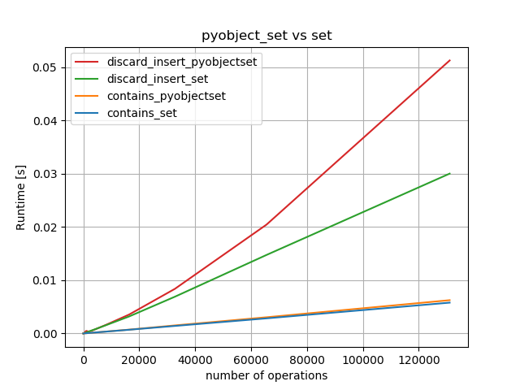
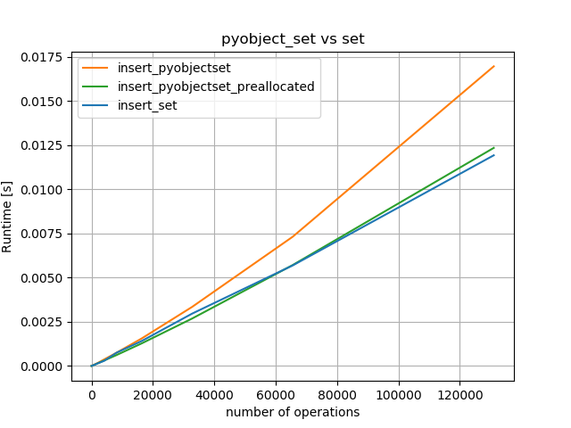

# cykhash

cython wrapper for khash

## About:

  * Brings functionality of khash (https://github.com/attractivechaos/klib/blob/master/khash.h) to Cython and can be used seamlessly in numpy or pandas.

  * Numpy's world is lacking the concept of a (hash-)set. This shortcoming is fixed and thus efficient `unique` and `isin` implementations are possible.

  * Python-set has a big memory-footprint. For some datatypes the overhead can be reduced by using khash.

  * Is inspired by usage of khash in pandas.
  
  * For python3 (versions 0.1 and 0.2 supported also python2)

This project was inspired by the following stackoverflow question: https://stackoverflow.com/questions/50779617/pandas-pd-series-isin-performance-with-set-versus-array

## Dependencies:

Essential:

  * Cython>=0.28 because verbatim C-code feature is used
  * build tool chain (for example gcc on Linux)

Additional dependencies for testing:

  * `sh`
  * `virtualenv`
  * `uttemplate`>=0.2.0 (https://github.com/realead/uttemplate)
  * `numpy`, `pandas`, `perfplot` for performance tests

## Instalation:

To install the module using pip run:

    pip install https://github.com/realead/cykhash/zipball/master

It is possible to uninstall it afterwards via

    pip uninstall cykhash

You can also install using the `setup.py` file from the root directory of the project:

    python setup.py install

However, there is no easy way to deinstall it afterwards (only manually) if `setup.py` was used directly.

## Performance

Run `sh run_perf_tests.sh` in tests-folder to reproduce. numpy and pandas will be installed in addtion to be able to run the performance tests. The easiest way is to call first `sh test_instalation.sh p3 local keep` and than activate it via `. ../p3/bin/activate` and only then call the performance 

#### Memory consumption:

Peak memory usage for N int64-integers (inclusive python-interpreter):

                      10^3       10^4      10^5       10^6      10^7
    python2-set        6MB        6MB      13MB       62MB      502MB
    python3-set        8MB        9MB      17MB       79MB      588MB
    cykhash (p3)      10MB       10MB      10MB       26MB      147MB

i.e. there is about 4 time less memory needed.

#### pd.unique()

The implementation of pandas' `unique` uses a hash-table instead of hash-set, which results in a 25% larger memory footprint. Using cykhash's set similar to this example

    cimport numpy as np
    import numpy as np

    from cykhash.khashsets cimport Int64Set, Int64SetIterator

    def unique_int64(np.int64_t[::1] data):
        cdef np.ndarray[dtype=np.int64_t] res
        cdef Int64Set s=Int64Set(len(data))
        cdef Int64SetIterator it
        cdef Py_ssize_t i
        cdef int cnt=0
        for i in range(len(data)):
            s.add(data[i])
        res=np.empty(s.table.size, dtype=np.int64)
        it = s.get_iter()
        for i in range(s.table.size):
            res[cnt]=it.next()
            cnt+=1
        return res

we can achieve better results, here an example of memory footprint:

    N      pd.unique()   cykhash's unique
    1e8      529 MB          364 MB
    2e8      790 MB          616 MB
    4e8     1950 MB         1200 MB
    6e8     3690 MB         2050 MB
    8e8     3000 MB         2300 MB

#### isin

Compared to pandas' `isin`, which has a linear running time in number of elements in the lookup. cykhash's `isin` has a `O(1)` in the number of elements in the look-up:

    n	pandas(#look-up=10^n)	cykhash(#look-up=10^n)
    2 	 0.0009466878400417045 	 0.0008094332498149015
    3 	 0.0011027359400759451 	 0.001505808719957713
    4 	 0.001315673690114636 	 0.0005093092197785154
    5 	 0.007601776499941479 	 0.00031931002013152465
    6 	 0.11544147745007649 	 0.000292295379913412
    7 	 0.7747500354002114 	 0.00047073251014808195

#### PyObjectSet:

There are no advantages (others that nans are handled correctly, more about it later) to use khash-version for normal Python-objects.

One caveau: `PyObject_Hash` doesn't yield a good hash-function (for example for integer `k` it is `k` and using it leads to quite bad results (running `python tests/perf_tests/pyobjectset_vs_set.py`):

as one can see, it is about 50 times slower then Python-set, and seems to have worse than linear behavior.

The problem is the "discard"  part, as the insertions alone aren't problematic:

Fixing it, leads to somewhat better discard behavior:

It is only 2 times slower than Python-set for inserting elements (but still somewhat not quite linear?. However it has also a negative impact on `insert`:

As conclusion:

   * `contains` are almost equally fast for `set`/`PyObjectSet`.
   * `insert` is slightly slower for `PyObjectSet`, preallocation should be used whenever possible.
   * `discard` is quite slow for `PyObjectSet`.

Insertion of Python-integers is 50% slower than the insertion of 64bit integers (see `tests/perf_tests/object_vs_int64_via_buffer.py`):

Using `PyObjectSet_from_buffer` is about 2.5 times faster than from iterator and 3 times faster than using `add`.

For best performance use `Int64Set` or, even better, `Int32Set`, which is about factor 2 faster than the 64bit-version.

 
#### PyObjectMap:

There are similar observation as for `PyObjectMap`, see `map_object_vs_int64_via_buffer.py` and `pyobjectmap_vs_dict.py` in 'tests/perf_tests`-folder.

The results are slightly worse (all above discard):

and

Also here the performance of the 64bit/32bit variant much better:

## Usage:

### Sets

Following classes are defined: 
         
  * `Int64Set` for 64 bit integers
  * `Int32Set` for 32 bit integers
  * `Float64Set`for 64 bit floats 
  * `Float32Set`for 32 bit floats 
  * `PyObjectSet`for arbitrary Python-objects

with Python interface:

  * `__len__`: number of elements in the set
  * `__contains__`: whether an element is contained in the set
  * `add`: adds an element to set
  * `discard`: remove an element or do nothing if element is not in the set
  * `__iter__`: returns an iterator through all elements in set

with Cython interface:

  * `contains`: checks whether an element is contained in the set
  * `add` : adds an element to the set
  * `discard` : remove an element or do nothing if element is not in the set
  * `get_iter`: returns an iterator with the following Cython interface:
       * `has_next`:returns true if there are more elements in the iterator
       * `next` :returns next element and moves the iterator

### Utility functions:

The following functions are available:

   * `XXXXSet_from(it)` - creates a `XXXXSet` from an iterable, with `XXXX` being either `Int64`, `Int32`, `Float64`, `Float32` or `PyObject`.
   * `XXXXSet_from_buffer(buf, size_hint=1.25)` creates a `XXXXSet` from an object which implements buffer interface, with `XXXX` being either `Int64`, `Int32`, `Float64`, `Float32` or `PyObject`. Starting size of hash-set is `int(size_hint*len(buf))`.
  * `isin_xxxx(query, db, result)` evaluates `isin` for `query` being a buffer of the right type, `db` - a corresponding `XXXXSet`, and result a buffer for with 8bit-itemsize, `xxxx` being either `int64`, `int32`, `float64`, `float32` or `pyobject`.

### Maps

Following classes are defined: 
         
  * `Int64to64Map` for mapping  64 bit integers to 64bit integer/floats
  * `Int32to32Map` for mapping 32 bit integers to 32bit integer/floats
  * `Float64to64Map`for mapping 64 bit floats to 64bit integer/floats
  * `Float32to32Map`for mapping 32 bit floats to 32bit integer/floats
  * `PyObjectMap`for arbitrary Python-objects as key/values

with Python interface:

  * `__len__`: number of elements in the map
  * `__contains__`: whether an element is contained in the map
  * `put_XXint/get_XXint`: setting/retrieving elements with XX=32 or 64 bits integer 
  * `put_XXfloat/get_XXfloat`: setting/retrieving elements with XX=32 or 64 bits float 
  * `__setitem__/__getitem___`: parameter `for_intXX` in the constructor deceides whether elements are intepreted as int or float (XX =  32 or 64 bits)
  * `discard`: remove an element or do nothing if element is not in the map
  * `__iter__`: returns an iterator through all elements in map

with Cython interface:

  * `contains`: checks whether an element is contained in the map
  * `put_XXint/get_XXint,put_XXfloat/get_XXfloat` : setting/getting elements in the map
  * `discard` : remove an element or do nothing if element is not in the map
  * `get_iter`: returns an iterator with the following Cython interface:
       * `has_next`:returns true if there are more elements in the iterator
       * `next` :returns next element and moves the iterator

### Utility functions:

The following functions are available:

   * `TypeXXtoXXMap_from_typeXX_buffer(keys, vals, size_hint)` - creates a `TypeXXtoXXMyp` from buffers with  `Type` either `Float` or `Int`, `XX` either 32 or 64 and `type` either `float` or `int`. Starting size of hash-map is `int(size_hint*min(len(keys), len(vals)))`.
   * `PyObjectMap_from_object_buffer` for keys, values as objects.

### Examples: 

In pure python:
 
    from cykhash import Int64Set
    s=Int64Set()
    s.add(1)
    print(1 in s)#prints true

In Cython:

    from cykhash.khashsets cimport Int64Set

    #returns True/False if element in db/not
    def isin(query, Int64Set db):
        for i in query:
            res.append(db.contains(i))
        return res

### Floating-point sets

There is a problem with floating-point sets, i.e. `Float64Set` and `Float32Set`: The standard definition of "equal" and hash-function based on the bit representation don't define a meaningful or desired behavior for the hash set:

   * `NAN != NAN` and thus it is not equivalence relation
   * `-0.0 == 0.0` but `hash(-0.0)!=hash(0.0)`, but `x==y => hash(x)==hash(y)` is neccessary for set to work properly.

This problem is resolved through following special case handling:

   * `hash(-0.0):=hash(0.0)`
   * `hash(x):=hash(NAN)` for any not a number `x`.
   * `x is equal y <=> x==y || (x!=x && y!=y)`

A consequence of the above rule, that the equivalence classes of `{0.0, -0.0}` and `e{x | x is not a number}` have more than one element. In the set these classes are represented by the first seen element from the class.

The above holds also for `PyObjectSet` (this behavior is different from `set` which shows a different behavior for nans)

## Testing:

For testing of the local version in an virtual environment run:

    sh test_install.sh 

in the `tests` subfolder.

For testing of the version from github run:

    sh test_install.sh from-github

For keeping the the virtual enviroment after the tests:

    sh test_install.sh local keep

To install and running tests in currently active environment:

    sh test_in_active_env.sh

## Versions:

  * 0.1.0: Int64Set
  * 0.2.0: Int32Set, Float64Set, Float32Set
  * 0.3.0: PyObjectSet

