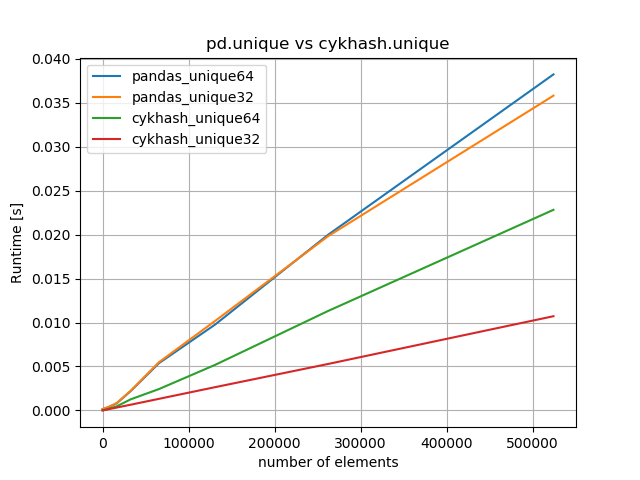
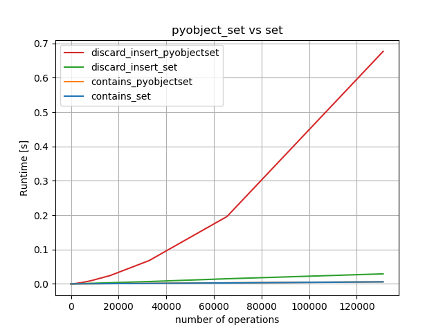
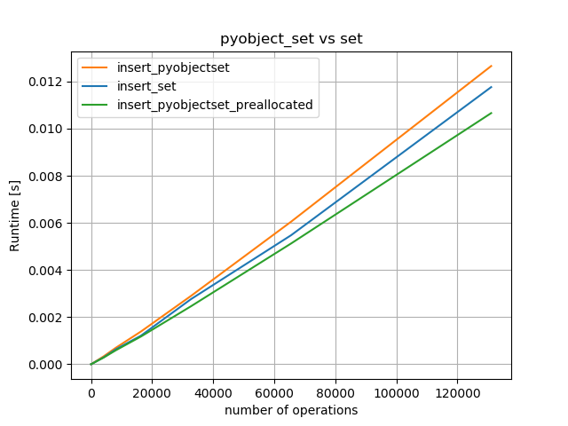
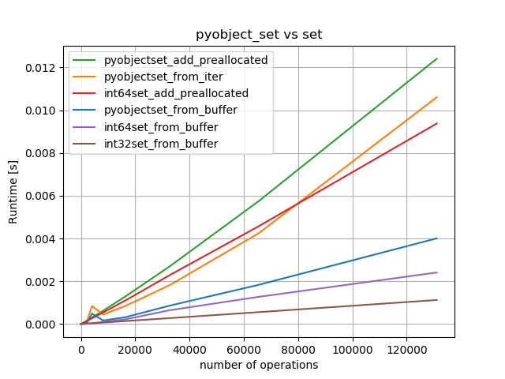
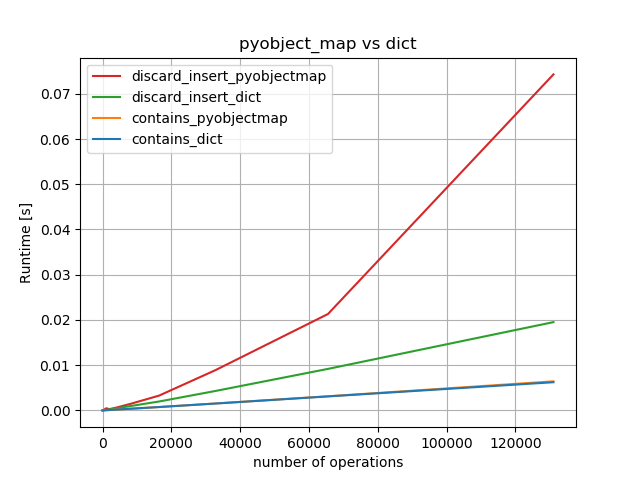
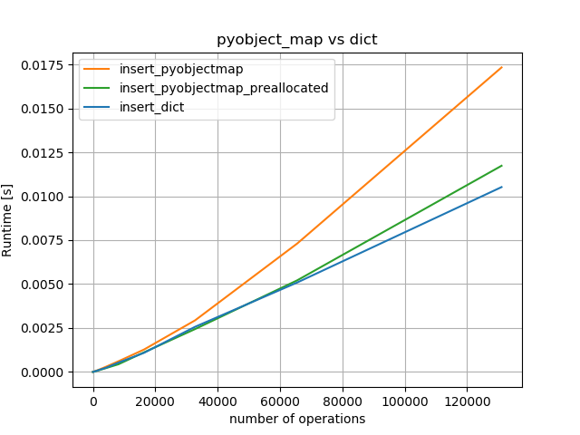
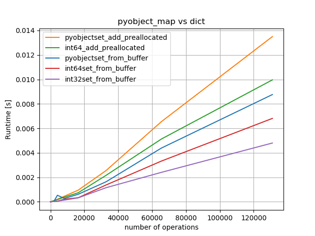

# Performance:

Run `sh run_perf_tests.sh` in tests-folder to reproduce. numpy and pandas need to be installed in addition to be able to run the performance tests. The easiest way is to call first `sh test_instalation.sh p3 local keep` and then activate it via `. ../p3/bin/activate` and only then call the performance tests, or to run `sh test_in_active_env.sh` to install in developer-mode in the current environment.

#### Memory consumption of sets:

Peak memory usage for N int64-integers (inclusive python-interpreter):

                      10^3       10^4      10^5       10^6      10^7
    python2-set        6MB        6MB      13MB       62MB      502MB
    python3-set        8MB        9MB      17MB       79MB      588MB
    cykhash (p3)      10MB       10MB      10MB       26MB      147MB

i.e. there is about 4 time less memory needed.

#### pd.unique()

Warning: cykhash's version of `unique` doesn't not return uniques in order of appearance (which pandas' version does!). `cykhash.unique` returns a object with buffer-interface, which can be used for creation of numpy-arrays via `np.frombuffer`.

The implementation of pandas' `unique` uses a hash-table instead of hash-set, which results in a larger memory footprint. `cykhash.unique_int64` (or `unique_int32`, `unique_float32`, `unique_float64`) uses much less memory and is also faster. See also question https://stackoverflow.com/questions/51485816/curious-memory-consumption-of-pandas-unique for more details.

There is no int32-version in `pandas`, such there is no difference to 64bit. `int32`-version of `cykhash` is twice as fast as `int64`-version, which is about factor 1.66 faster than the pandas' version. Run `tests/perf_tests/khashunique_vs_pdunique.py` to generate the plot.

Peak memory overhead (additional needed memory given as `maximal_overhead_factor`) for unique (run `tests/perf_tests/run_memory_unique_test.sh` to generate the numbers). i.e. additional memory needed is `N*maximal_overhead_factor`

    N      pd.unique()   cykhash.unique_int64
    1e6        6.24          2.18
    2e6        6.19          2.15
    4e6        6.35          2.16
    6e6        4.86          1.44
    8e6        6.25          2.16
    9e6        7.50          1.90

While `pd.unique` needs up to 8 times the original memory, `cykhash` at most 3 times the original memory. For the special case of `int32` the overhead-factor of `pd.unique` more than doubles because it doesn't have a dedicated int32-version and data must be converted to int64. 

More precise the worst case scenario (while still without triggering rehashing) for `cykhash.unique_int64`, the overhead-factor can be `1.3*2*(1+1/64)=2.64` where:
  
 * 1.3 due to the fact that rehashing happens when more than 77% of buckets are occupied.
 * 2 due to the fact, that khash doubles the size every time
 * 1+1/64 that one bit is used for flags

#### isin

Compared to pandas' `isin`, which has a linear running time in number of elements in the lookup. cykhash's `isin` has a `O(1)` in the number of elements in the look-up:

    n	pandas(#look-up=10^n)	cykhash(#look-up=10^n)
    2 	 0.0009466878400417045 	 0.0008094332498149015
    3 	 0.0011027359400759451 	 0.001505808719957713
    4 	 0.001315673690114636 	 0.0005093092197785154
    5 	 0.007601776499941479 	 0.00031931002013152465
    6 	 0.11544147745007649 	 0.000292295379913412
    7 	 0.7747500354002114 	 0.00047073251014808195

#### PyObjectSet:

There are no advantages (others that nans are handled correctly, more about it later) to use khash-version for normal Python-objects.

One caveau: `PyObject_Hash` doesn't yield a good hash-function (for example for integer `k` it is `k` and using it leads to quite bad results (running `python tests/perf_tests/pyobjectset_vs_set.py`):

as one can see, it is about 50 times slower then Python-set, and seems to have worse than linear behavior.

The problem is the "discard"  part, as the insertions alone aren't problematic:

Fixing it, leads to somewhat better discard behavior:

It is only 2 times slower than Python-set for inserting elements (but still somewhat not quite linear?. However it has also a negative impact on `insert`:

As conclusion:

   * `contains` are almost equally fast for `set`/`PyObjectSet`.
   * `insert` is slightly slower for `PyObjectSet`, preallocation should be used whenever possible.
   * `discard` is quite slow for `PyObjectSet`.

Insertion of Python-integers is 50% slower than the insertion of 64bit integers (see `tests/perf_tests/object_vs_int64_via_buffer.py`):

Using `PyObjectSet_from_buffer` is about 2.5 times faster than from iterator and 3 times faster than using `add`.

For best performance use `Int64Set` or, even better, `Int32Set`, which is about factor 2 faster than the 64bit-version.

 
#### PyObjectMap:

There are similar observation as for `PyObjectMap`, see `map_object_vs_int64_via_buffer.py` and `pyobjectmap_vs_dict.py` in 'tests/perf_tests`-folder.

The results are slightly worse (all above discard):

and

Also here the performance of the 64bit/32bit variant much better:

